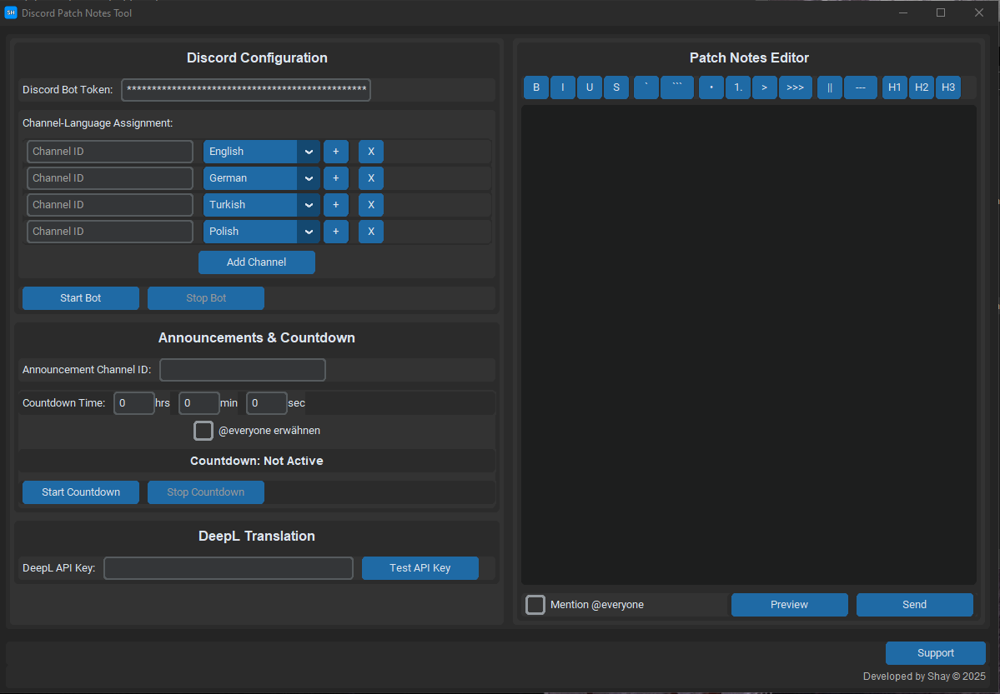

# 🔧 Patch Notes Tool

A professional Discord tool for managing and translating patch notes across multiple channels and languages.

## 🌟 Key Features

### 📝 Patch Notes Editor
- Real-time preview of formatted text
- Full Discord markdown support:
  - Bold, Italic, Underline
  - Code blocks
  - Lists and Quotes
  - Spoilers
  - And more!

### 🌍 Automatic Translation
- Professional translations via DeepL API
- Supported Languages:
  - German (DE)
  - English (US/GB)
  - Italian (IT)
  - Romanian (RO)
  - Turkish (TR)
  - Polish (PL)
- Preview all translations before sending
- High-quality real-time translations

### 📢 Discord Integration
- Manage multiple channels simultaneously
- Individual language settings per channel
- Optional @everyone mentions
- Professional embed layout

### ⏰ Countdown System
- Server restart announcements
- Automatic Discord updates
- Adjustable time intervals
- @everyone mentions for important updates

## 🚀 Getting Started

### 1. **DeepL API Key (Required)**
- Register for an API key at [DeepL Developer](https://www.deepl.com/pro-api)
- Free tier is sufficient for normal usage
- Insert your API key in the tool

### 2. **Discord Bot Setup**
- Create a new bot at [Discord Developer Portal](https://discord.com/developers/applications)
- Enable required bot permissions:
  - `Send Messages`
  - `Embed Links`
  - `Mention @everyone`
- Copy the bot token

### 3. **Tool Configuration**
- Add your channel IDs
- Select desired languages per channel
- Test the connection with "Start Bot"

## 💡 Tips & Tricks

- **Multiple Languages:** Select multiple languages per channel
- **Preview:** Use the preview function to check translations before sending
- **Formatting:** Use the toolbar for easy markdown formatting
- **Countdown:** Perfect for planned server maintenance or events

## 🛠️ Support

Need help?
- Join our [Discord Support Server](https://discord.gg/7aum2ZfmU3)
- Open a support thread in #❓help-requests
- Contact the developer directly

## 📜 License

This tool is free to use. Developed by Shay.

## 🔒 Security & Data Storage

- All sensitive data (tokens, API keys) is securely encrypted
- Data is stored locally in: `C:\Users\[Username]\AppData\Local\PatchNotesTool`
- No cloud storage or external data transmission
- Each installation has its own encrypted configuration
- Tokens are hardware-bound to your PC for maximum security

---

*Important: A DeepL API key is required to use this tool. The free tier of the DeepL API is sufficient for normal usage.*

## ❓ FAQ

### Why do I need a DeepL API key?
The DeepL API key is required for automatic translations, which are a core feature of this tool.

### How do I get a DeepL API key?
1. Go to [www.deepl.com/pro-api](https://www.deepl.com/pro-api)
2. Create a free account
3. Find your API key in the account section

### How do I set up the Discord bot?
1. Go to [Discord Developer Portal](https://discord.com/developers/applications)
2. Click "New Application" and name your bot
3. Go to the "Bot" section and click "Add Bot"
4. Copy the bot token (not the Client ID!)
5. Enable permissions for:
   - Send Messages
   - Embed Links
   - Mention @everyone
6. Invite the bot to your server using the OAuth2 link

### What if I get translation errors?
Check if your DeepL API key is valid and if you haven't exceeded the monthly translation limit. The free plan includes 500,000 characters per month.

### Can I use the bot in multiple channels?
Yes! You can add as many channels as you want and set individual language preferences for each channel.

### The bot won't start, what can I do?
1. Check if your bot token is correct
2. Ensure the bot has the right permissions
3. Verify that your channel IDs exist
4. Check if your DeepL API key is valid

### How do I get the channel ID?
1. Enable Developer Mode in Discord (Settings → App Settings → Advanced)
2. Right-click on the desired channel
3. Select "Copy ID"

### Do I need Python on my PC?
No! The tool comes as a standalone .exe file and runs without additional installation.

### Where can I get help?
Click the "Support" button in the tool to join our Discord server where the team will help you!

Made with 💙 by Shay 
